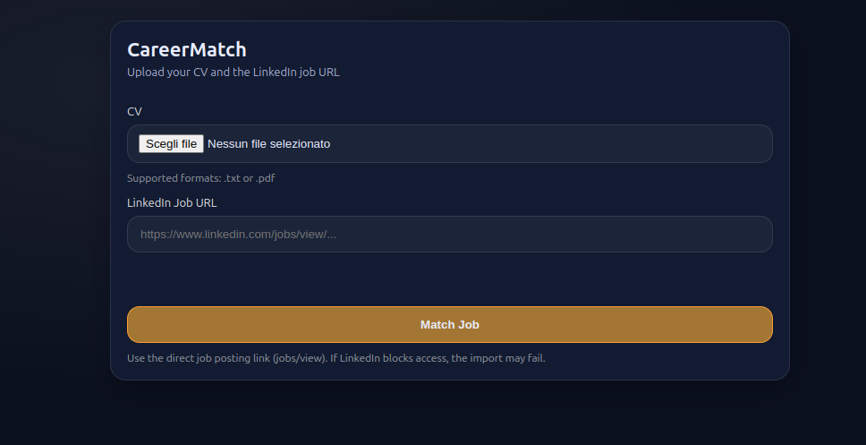
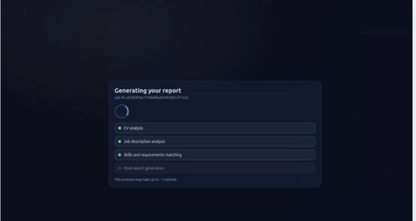
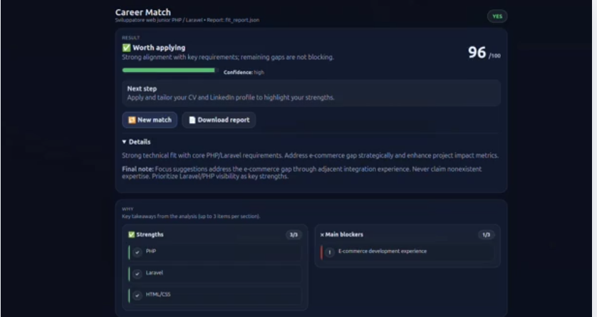

# CareerMatch

[](LICENSE)

CareerMatch is an open-source, Docker-ready proof of concept that compares a CV with a LinkedIn job post and generates a structured fit report, including a score, strengths, gaps, and actionable suggestions.

This project intentionally uses **only free LLM models available on OpenRouter** and is built on top of the **datapizza-ai framework**.

CareerMatch is **not a production-ready application**, but an experimental playground to explore CV–job matching strategies, prompt design, and deterministic post-processing.

The project is and will remain **fully open source**. Suggestions, improvements, and contributions are welcome.

---

## Requirements
- Docker
- Docker Compose

---

## Setup

### 1) Download
Clone the repository or download the ZIP from GitHub, then enter the project folder.

---

### 2) Environment configuration
Create a `.env` file from the example:

```bash
cp .env.example .env
```

Edit `.env`:

```env
OPENAI_API_KEY=YOUR_API_KEY
OPENAI_MODEL=google/gemma-3n-e2b-it:free
OPENAI_BASE_URL=https://openrouter.ai/api/v1
```
> Rate limits may apply depending on the selected model.

---

### 3) Run with Docker
Build and start the application:

```bash
docker compose up -d --build
```

Open the app in your browser:

```
http://localhost:8000
```

Stop the application:

```bash
docker compose down
```

---

## Usage

1. Upload your **CV** in **PDF or TXT** format  
2. Paste the **LinkedIn job post URL**  
3. Start the analysis and wait for completion  

The generated report includes:
- Overall fit score
- Key strengths aligned with the job
- Identified gaps
- Actionable suggestions to improve your CV and LinkedIn profile

Reports can be downloaded in **HTML** and **JSON** formats.

---

## Screenshots






---

## Notes
- This project is a **proof of concept**, not a production hiring tool
- Free-tier LLM models may return HTTP 429 errors due to rate limits
- Generated files are stored in `jobs/` and `outputs/` via Docker volumes
- Built using the **datapizza-ai framework**
- Fully **open source** – contributions are welcome
